# Boini (보이니)

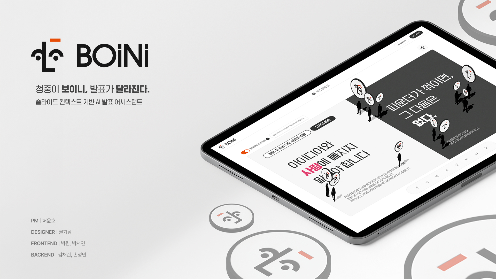

Boini는 발표자와 청중이 실시간으로 상호작용할 수 있는 프레젠테이션 플랫폼입니다. 발표자는 PDF를 업로드해 세션을 만들고, 청중은 코드 또는 QR로 입장해 슬라이드를 따라가며 질문, 이모지 반응, 피드백을 남길 수 있습니다. 세션 종료 후에는 AI 리포트로 발표 흐름과 반응을 분석합니다.

## 주요 기능

- 실시간 세션 생성 및 발표 진행
- 청중 참여: 질문, 이모지 스티커, 발표 추적
- WebSocket 기반 슬라이드/세션 상태 동기화
- 세션 종료 후 AI 리포트 및 만족도 확인
- Presenter / Audience 이중 플로우 지원

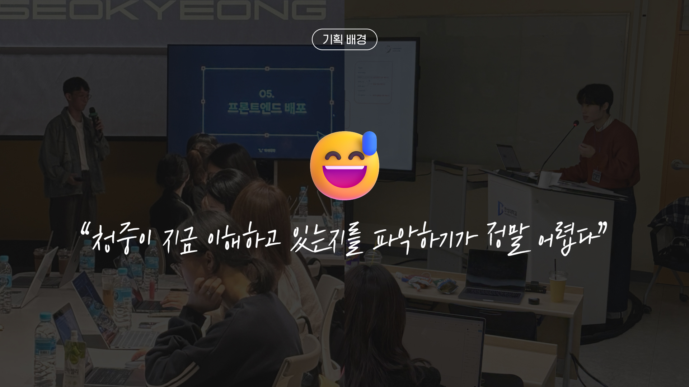
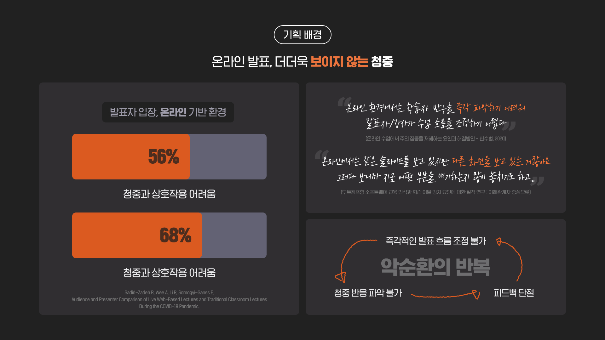
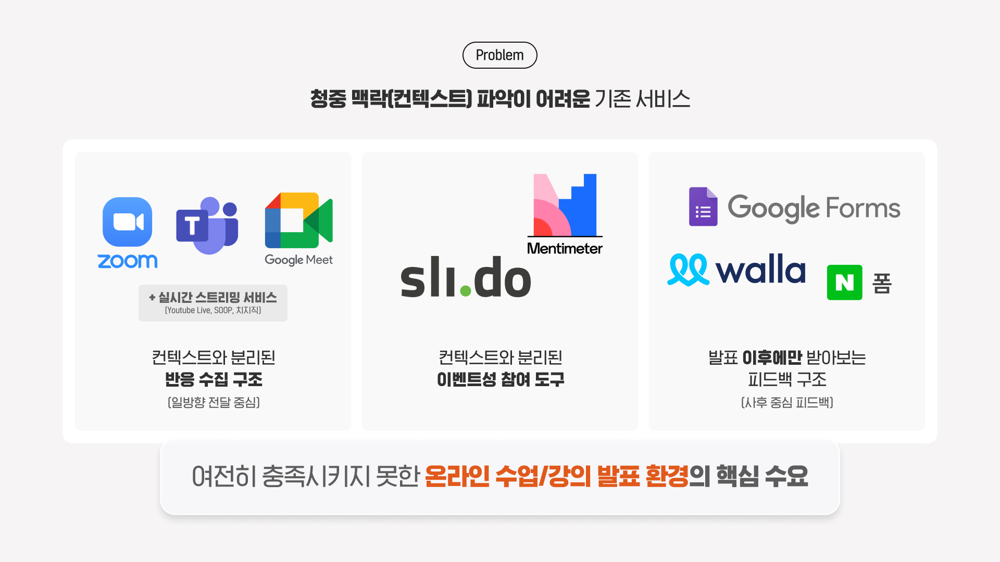
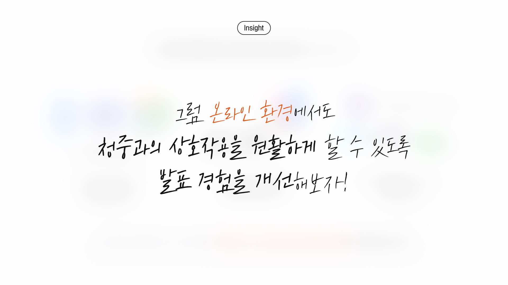
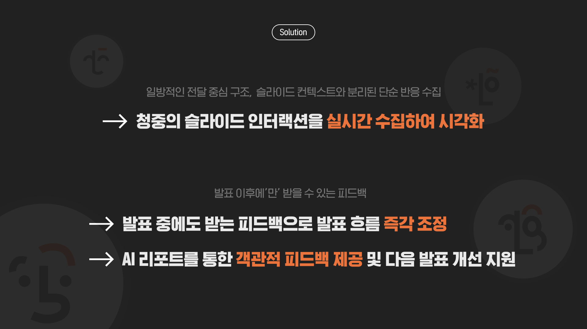
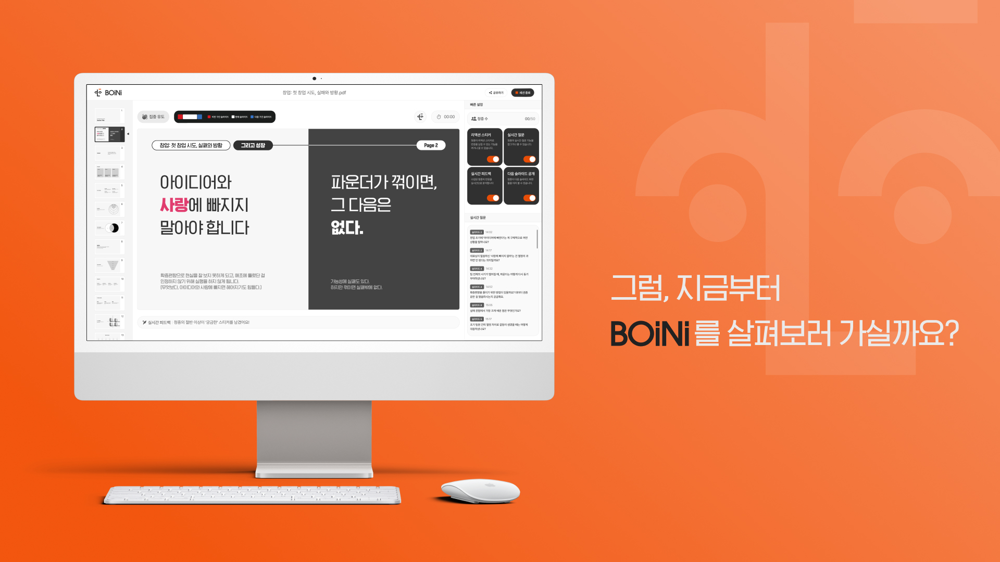
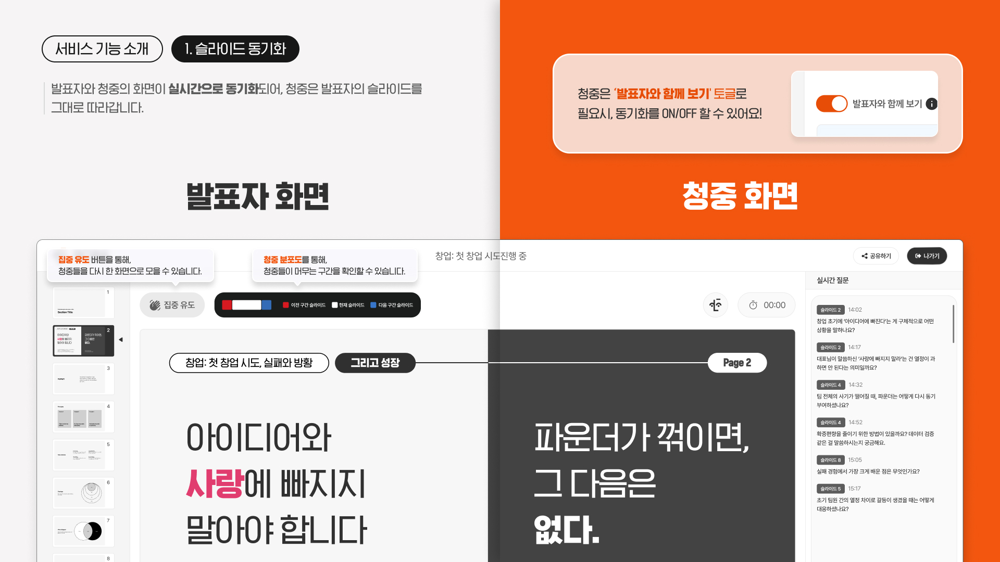
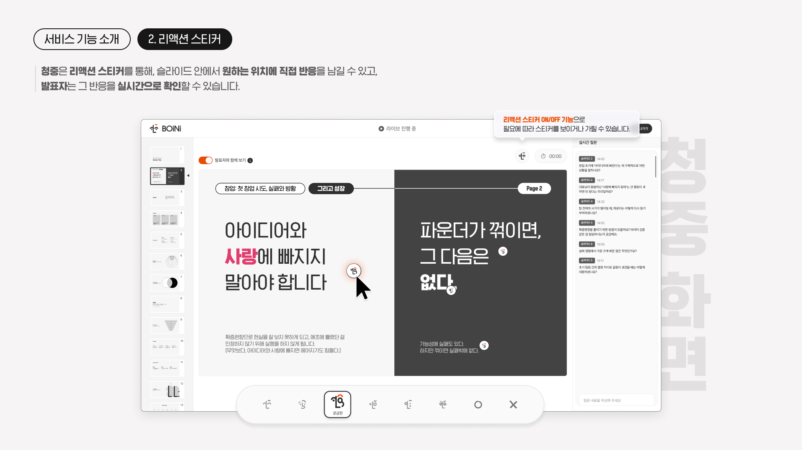
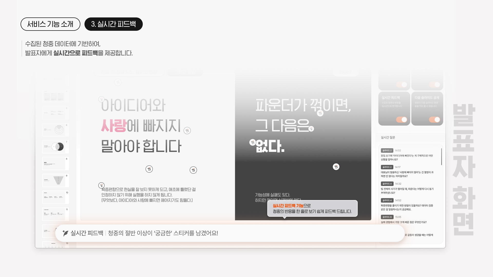
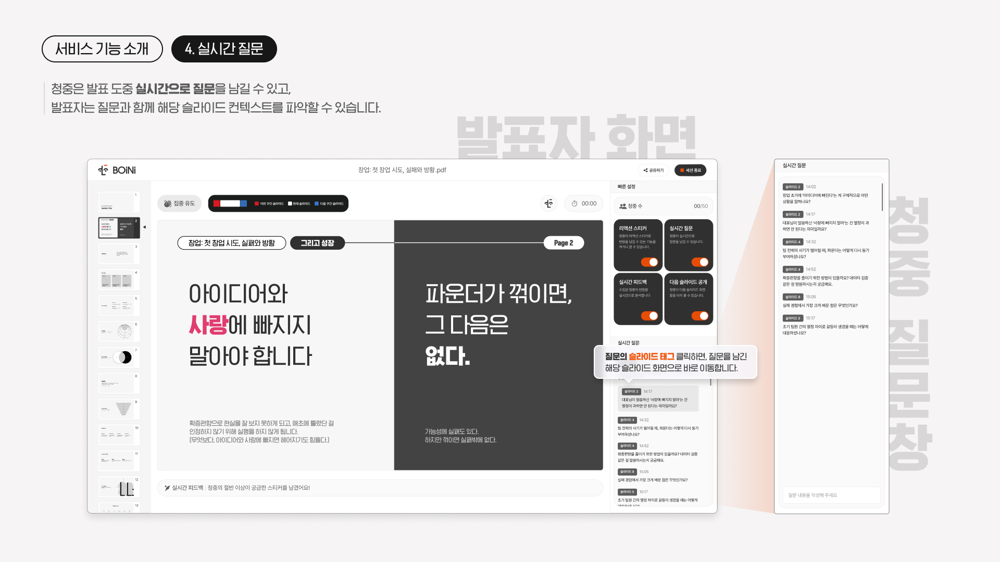
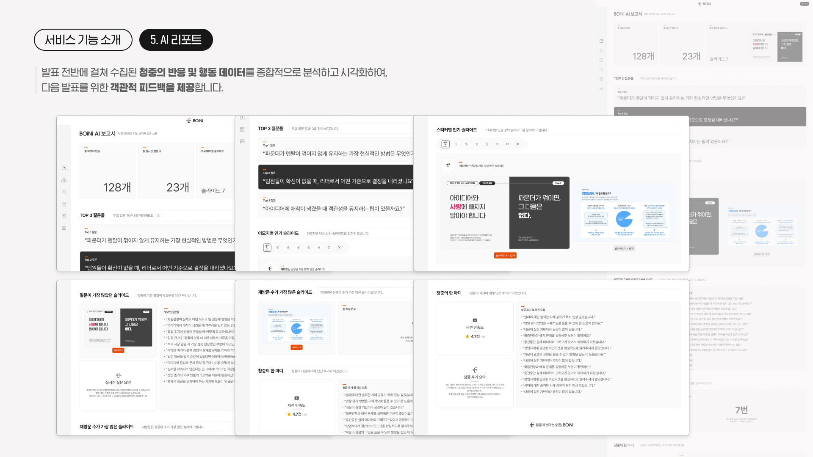
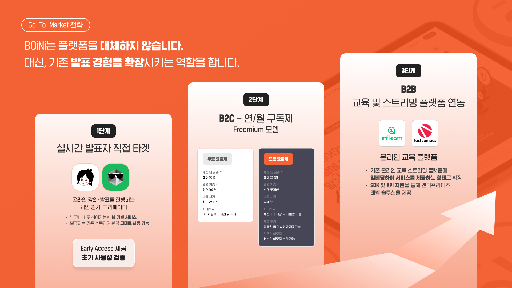

## 기술 스택


주요 라이브러리:

- `axios`
- `@stomp/stompjs`, `sockjs-client`
- `react-pdf`, `pdfjs-dist`
- `recharts`
- `qrcode.react`

## 아키텍처

현재 프론트엔드는 **Feature-Sliced Design 기반 구조**로 정리되어 있습니다. 핵심 원칙은 다음과 같습니다.

- `app`: 부트스트랩, 라우터, 전역 앱 셸
- `pages`: 라우트 단위 화면과 페이지 전용 모델
- `widgets`: 여러 페이지에서 재사용되는 복합 UI
- `entities`: 도메인 상태, 타입, 모델, 재사용 가능한 도메인 UI
- `shared`: API, 설정, 유틸, 에셋, 저수준 UI 인프라

현재 앱은 `features/`, `services/`, `hooks/`, `store/` 같은 기술 중심 top-level 폴더를 더 이상 사용하지 않고, 책임 기준으로 코드를 배치합니다.

## 라우트 구조

```text
/                         랜딩 페이지
/rooms/new                새 세션 생성
/rooms/:roomId/prepare    세션 준비
/rooms/:roomId/present    발표 진행
/rooms/:roomId/report     AI 리포트
/join/:code               청중 입장
/audience/:code/rating    세션 종료 후 만족도 평가
```

라우터 구현은 [`src/app/router.tsx`](./src/app/router.tsx) 에 있습니다.

## 프로젝트 구조

```text
src/
├── app/                        # 앱 셸, 라우터, 부트스트랩
├── pages/                      # 라우트 소유 페이지
│   ├── landing/
│   ├── session-create/
│   ├── presenter-room/
│   ├── audience-room/
│   ├── ai-report/
│   └── rating/
├── widgets/                    # 재사용 복합 UI
│   ├── app-header/
│   ├── presentation-layout/
│   └── slides-sidebar/
├── entities/                   # 도메인 모델/상태/UI
│   ├── room/
│   ├── session/
│   ├── slide/
│   ├── question/
│   └── reaction/
├── shared/
│   ├── api/                    # API 클라이언트, WebSocket, transport
│   ├── config/                 # 환경값, 상수, storage key
│   ├── lib/                    # logger, storage, blob, url helper
│   ├── assets/                 # 이미지, 아이콘
│   └── ui/                     # 저수준 공통 UI
└── styles/                     # 전역 스타일
```

## 세션 라이프사이클

세션의 전체 동작 흐름은 아래 문서에 정리되어 있습니다.

- [`docs/session-lifecycle.md`](./docs/session-lifecycle.md)

문서에는 다음 내용이 포함되어 있습니다.

- Presenter / Audience 전체 세션 흐름
- REST API + WebSocket + `sessionStorage` + 상태 모델 관계
- AI 리포트와 rating 페이지로 이어지는 후속 플로우
- Mermaid 다이어그램 기반 런타임 설명

## 실행 방법

### 설치

```bash
npm install
```

### 개발 서버

```bash
npm run dev
```

### 프로덕션 빌드

```bash
npm run build
```

### 타입 검사

```bash
npm run typecheck
```

### 린트

```bash
npm run lint
```

### 포맷

```bash
npm run format
npm run format:check
```

## 개발 원칙

- React 19 + TypeScript를 기준으로 구현합니다.
- 페이지 간 직접 의존 대신 slice public API를 통해 import 합니다.
- 도메인 로직은 `entities`, 페이지 전용 로직은 `pages/*/model` 에 둡니다.
- 공통 인프라만 `shared` 에 두고, UI 복합체는 `widgets` 로 올립니다.
- 세션 복원은 `sessionStorage` 와 도메인 상태를 함께 사용합니다.

## 커밋 컨벤션

| 태그       | 용도                     |
| ---------- | ------------------------ |
| `feat`     | 기능 추가                |
| `fix`      | 버그 수정                |
| `refactor` | 구조 개선 및 리팩토링    |
| `docs`     | 문서 수정                |
| `test`     | 테스트 추가 또는 수정    |
| `chore`    | 설정, 패키지, 도구 변경  |

## 라이선스

이 프로젝트는 4호선톤 프로젝트입니다.
