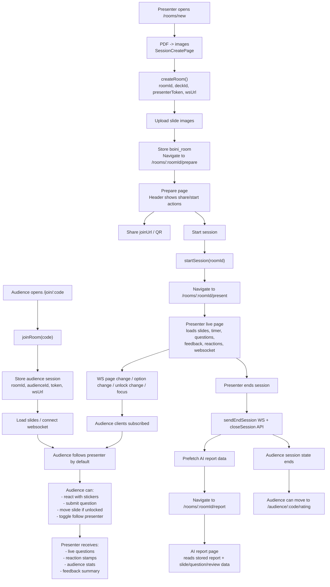
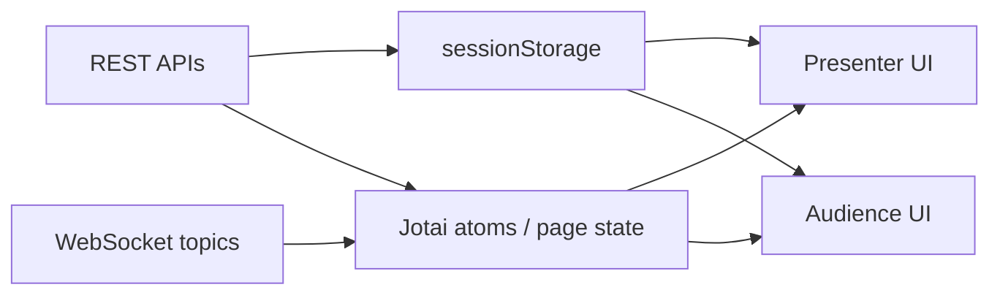

# Session Lifecycle

This document explains the full runtime lifecycle of a session in the Boini frontend, covering both presenter and audience behavior.

## Overview

The app has two main user flows:

- Presenter flow: create a room, upload slides, start a live session, present, end the session, open the AI report
- Audience flow: join by code, sync with presenter, react, ask questions, submit a rating at the end

At runtime, the app combines:

- REST APIs for room/session creation and data fetching
- WebSocket topics for real-time sync
- `sessionStorage` for refresh resilience
- Jotai atoms and page-local state for active UI state

## Full Lifecycle

## Presenter Lifecycle

### 1. Session preparation

The presenter opens `/rooms/new` and uploads a PDF.

The frontend then:

- converts the PDF into slide images
- creates a room via API
- uploads slide images
- fetches original slide URLs
- stores room data in `sessionStorage` under `boini_room`
- navigates to `/rooms/:roomId/prepare`

Main file:

- [`src/pages/session-create/ui/SessionCreatePage.tsx`](/Users/yh/Desktop/line4thon-presentation-frontend/src/pages/session-create/ui/SessionCreatePage.tsx)

### 2. Prepare page

On the prepare page, the presenter can:

- preview slides
- inspect quick settings
- share the join URL and QR
- start the session

The header widget resolves room data from route state or `sessionStorage`, then uses that data to drive share and start actions.

Main files:

- [`src/widgets/app-header/ui/AppHeader.tsx`](/Users/yh/Desktop/line4thon-presentation-frontend/src/widgets/app-header/ui/AppHeader.tsx)
- [`src/widgets/app-header/model/useHeaderRoomData.ts`](/Users/yh/Desktop/line4thon-presentation-frontend/src/widgets/app-header/model/useHeaderRoomData.ts)
- [`src/widgets/app-header/model/useHeaderSessionAction.ts`](/Users/yh/Desktop/line4thon-presentation-frontend/src/widgets/app-header/model/useHeaderSessionAction.ts)

### 3. Start session

When the presenter clicks the start button:

- `startSession(roomId)` is called
- the app navigates to `/rooms/:roomId/present`

The presenter page then initializes:

- slide loading
- timer
- presenter WebSocket connection
- live questions
- live feedback
- reaction stamps
- audience stats

Main file:

- [`src/pages/presenter-room/ui/PresenterRoomPage.tsx`](/Users/yh/Desktop/line4thon-presentation-frontend/src/pages/presenter-room/ui/PresenterRoomPage.tsx)

### 4. Live presenting

During the live session, the presenter can:

- navigate slides
- unlock or lock future slides
- enable or disable stickers, questions, and feedback
- trigger focus highlight
- observe audience count and audience distribution
- see incoming questions and reactions

Presenter-originated real-time actions are sent through the shared WebSocket service.

Main transport file:

- [`src/shared/api/websocket.ts`](/Users/yh/Desktop/line4thon-presentation-frontend/src/shared/api/websocket.ts)

### 5. End session

When the presenter ends the session:

- the app sends an end-session WebSocket event
- calls the close-session API
- prefetches report data
- stores AI report room context
- navigates to `/rooms/:roomId/report`

Main file:

- [`src/widgets/app-header/model/useHeaderSessionAction.ts`](/Users/yh/Desktop/line4thon-presentation-frontend/src/widgets/app-header/model/useHeaderSessionAction.ts)

## Audience Lifecycle

### 1. Join room

The audience opens `/join/:code`.

The frontend then:

- calls `joinRoom(code)`
- receives `roomId`, `audienceId`, `audienceToken`, `deckId`, `wsUrl`, and session options
- stores audience session data in `sessionStorage`
- populates room and session state atoms

Main file:

- [`src/pages/audience-room/model/useAudienceJoinRoom.ts`](/Users/yh/Desktop/line4thon-presentation-frontend/src/pages/audience-room/model/useAudienceJoinRoom.ts)

### 2. Audience page initialization

Once joined, the audience page initializes:

- slide loading
- audience WebSocket connection
- presenter-follow behavior
- question state
- reaction state
- unlock and session status state

Main file:

- [`src/pages/audience-room/ui/AudienceRoomPage.tsx`](/Users/yh/Desktop/line4thon-presentation-frontend/src/pages/audience-room/ui/AudienceRoomPage.tsx)

### 3. Real-time sync

The audience subscribes to WebSocket topics for:

- page change
- focus highlight
- option change
- unlock change
- session state
- question updates

By default, audience clients follow the presenter’s current slide.

Main file:

- [`src/pages/audience-room/model/useAudienceWebSocketSubscriptions.ts`](/Users/yh/Desktop/line4thon-presentation-frontend/src/pages/audience-room/model/useAudienceWebSocketSubscriptions.ts)

### 4. Audience actions

During a live session, the audience can:

- react with stickers
- submit questions
- browse slides if the unlock setting allows it
- toggle follow-presenter mode

Those actions feed back into presenter-visible UI such as:

- reaction stamps on slides
- question lists
- audience slide distribution
- live feedback summaries

## AI Report Lifecycle

After session end, the presenter is navigated to `/rooms/:roomId/report`.

The report page reads:

- stored room info
- stored AI report payload
- per-section report data such as top reactions, top questions, revisit slides, and review summaries

Main file:

- [`src/pages/ai-report/ui/AiReportPage.tsx`](/Users/yh/Desktop/line4thon-presentation-frontend/src/pages/ai-report/ui/AiReportPage.tsx)

## State Model

### Responsibilities

- REST APIs bootstrap durable identifiers and fetch report/slide data
- `sessionStorage` keeps room and audience session data across refresh
- Jotai atoms hold shared active state such as room/session options
- page-local state handles UI details and transient interactions
- WebSocket topics keep presenter and audience synchronized in real time

## Important Files

Presenter:

- [`src/pages/session-create/ui/SessionCreatePage.tsx`](/Users/yh/Desktop/line4thon-presentation-frontend/src/pages/session-create/ui/SessionCreatePage.tsx)
- [`src/pages/presenter-room/ui/PresenterRoomPage.tsx`](/Users/yh/Desktop/line4thon-presentation-frontend/src/pages/presenter-room/ui/PresenterRoomPage.tsx)
- [`src/widgets/app-header/model/useHeaderSessionAction.ts`](/Users/yh/Desktop/line4thon-presentation-frontend/src/widgets/app-header/model/useHeaderSessionAction.ts)

Audience:

- [`src/pages/audience-room/ui/AudienceRoomPage.tsx`](/Users/yh/Desktop/line4thon-presentation-frontend/src/pages/audience-room/ui/AudienceRoomPage.tsx)
- [`src/pages/audience-room/model/useAudienceJoinRoom.ts`](/Users/yh/Desktop/line4thon-presentation-frontend/src/pages/audience-room/model/useAudienceJoinRoom.ts)
- [`src/pages/audience-room/model/useAudienceWebSocketSubscriptions.ts`](/Users/yh/Desktop/line4thon-presentation-frontend/src/pages/audience-room/model/useAudienceWebSocketSubscriptions.ts)

Transport and shared state:

- [`src/shared/api/room.ts`](/Users/yh/Desktop/line4thon-presentation-frontend/src/shared/api/room.ts)
- [`src/shared/api/presentation.ts`](/Users/yh/Desktop/line4thon-presentation-frontend/src/shared/api/presentation.ts)
- [`src/shared/api/websocket.ts`](/Users/yh/Desktop/line4thon-presentation-frontend/src/shared/api/websocket.ts)

## Summary

At a high level:

1. Presenter creates a room and uploads slides
2. Presenter starts the session
3. Audience joins by code and syncs over WebSocket
4. Presenter and audience interact in real time through slide changes, stickers, questions, and settings
5. Presenter ends the session
6. AI report is generated and shown
7. Audience can submit a final rating
